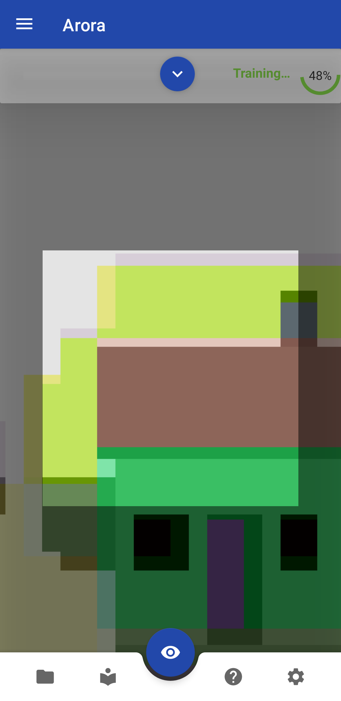
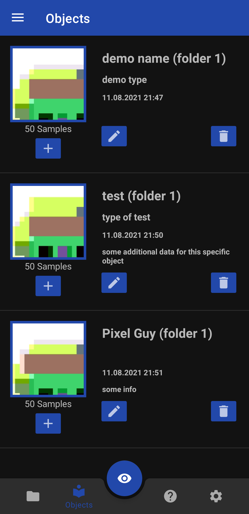
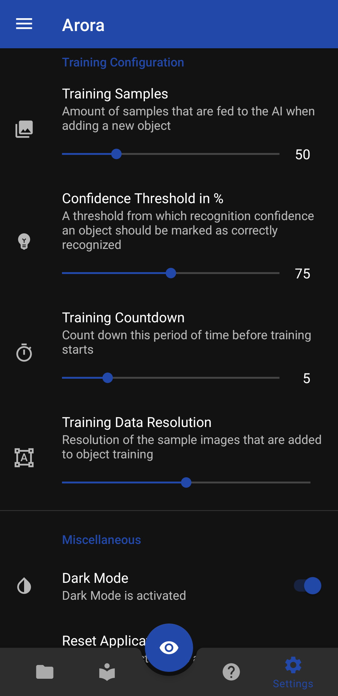

# ARORA

## **A**ugmented **R**eality **O**bject **R**ecognition **A**pplication

Software Engineering Projektarbeit Aalen University

 |Main Screen (Train / Detect)|Overview of trained objects|Settings|
 |-------|----|---|
 ||||

## Usage

- Clone the project and open it in Android Studio.
- Build with gradle

- You can also load the APK provided in the root directory of this repository directly onto your device to start the app.

## About

**ARORA** (Augmented Reality and Object Recognition Application) is an Android application that was developed as part of a project at Aalen University in Germany. With this application it is possible to train a model for custom objects and mapping them to information and other metadata like their type and additional information.

This is made possible by extending an already trained object recognition AI with additional objects using so-called Transfer Learning or more specifically Continual Learning.

This functionality can be applied in various areas such as the tourism industry, Augmented Reality games and many more.

A special thing about this method is that all processing happens on the mobile device without the needs of an external server. This makes it possible to use the application even without internet access.

The model used is a MobilenetV2, which has been extended by a configurable Softmax layer. It is possible to change the model.
More information about the configuration of a custom object folder can be found [here](https://github.com/tensorflow/examples/blob/master/lite/examples/model_personalization/README.md#converting-the-model-using-the-cli).
